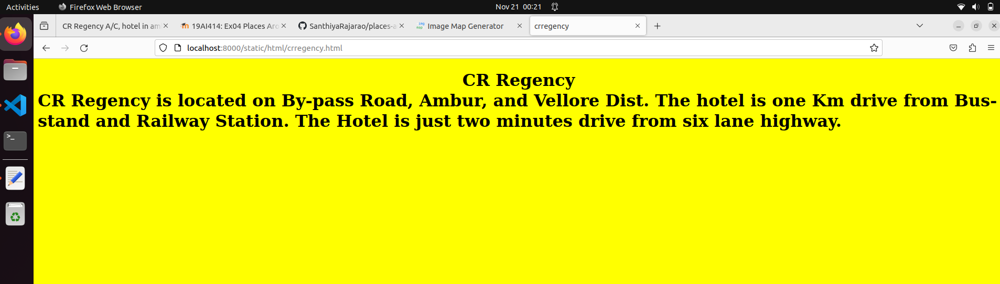

# Places Around Me
## AIM:
To develop a website to display details about the places around my house.

## Design Steps:

### Step 1:
Write code appropriately
### Step 2:
Run the Program
## Code:
<!DOCTYPE html>
<html>
    <head>
        <title>
            Imagemaps Demo
        </title>
    </head>
    <body>
        <h1>
        Imagemaps Demo
            <map name="image_map">
                <area alt="murugantheatre" title="murugantheatre" href="murugantheatre.html" coords="432,61,523,148" shape="rect">
                <area alt="crregency" title="crregency" href="crregency.html" coords="513,135,542,193" shape="rect">
                <area alt="saisangeet" title="saisangeet" href="saisangeet.html" coords="461,164,513,246" shape="rect">
                <area alt="hitachiatm" title="hitachiatm" href="hitachiatm.html" coords="605,199,682,279" shape="rect">
                <area alt="amburstarbriyani" title="amburstarbriyani" href="amburstarbriyani.html" coords="932,124,1030,192" shape="rect">
            </map>

        
        </h1>
    </body>
</html>

## Output:

## Result:
Thus the result executed successfully
